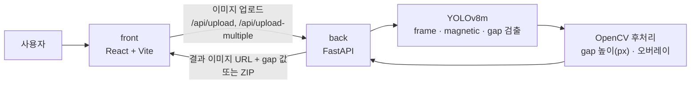

# VisGAP — 스마트폰 카메라 부품 간격(Gap) 자동 측정

> 스마트폰 후면 카메라 미세 부품의 **간격(gap) 검사**를 자동화한 프로젝트입니다. 이미지를 올리면 YOLO가 `frame`·`magnetic`·`gap`을 검출하고, **gap 높이(px)를 자동으로 측정**해 결과 이미지로 돌려줍니다. (기업 연계 과제)


| 항목 | 내용 |
|---|---|
| 기간 | 2025.03 ~ 2025.06 |
| 유형 | 기초 캡스톤디자인 (기업 연계, 팀 프로젝트) |
| 팀 구성 | 5명 |
| 내 역할 | **팀장 · AI** (데이터셋 구축, 모델 학습, AI 추론 서버) |

> **공개 범위**: 학습 데이터, 제품 이미지, 학습된 가중치는 협력 기업이 제공한 자료이거나 그 자료로 만든 결과물이라 공개하지 않습니다. 이 저장소에는 **코드만** 담았습니다. 화면의 예시 이미지는 자리 표시용 이미지로 바꿨습니다.

---

## 핵심 기능

1. **객체 검출**: `frame`, `magnetic`, `gap` 3개 클래스를 YOLOv8m으로 검출
2. **gap 높이 측정**: 검출된 gap 박스의 높이를 px 단위로 계산해 이미지 위에 표시
3. **영역 시각화**: frame / magnetic 영역을 반투명 색으로 오버레이
4. **단일·다중 처리**: 한 장이면 결과 이미지와 gap 값 목록을, 여러 장이면 결과 이미지 전체를 ZIP으로 반환
5. **처리 시간 표시**: 서버 처리 시간을 응답에 포함

---

## 아키텍처



- **front / back / ai_server를 분리했습니다.** 화면, API, 모델 추론을 나눠 팀원이 병렬로 작업할 수 있게 했습니다. 최종 연동은 `back`이 모델을 직접 로드하는 구조이고, `ai_server`는 모델 추론 단독 서버 버전입니다.

## 접근 과정

| 단계 | 시도 | 결과 |
|---|---|---|
| 1 | 배경 제거(RMBG), OTSU 이진화, Contour 기반 고전 영상처리 | 실험 후 딥러닝 검출로 전환 |
| 2 | Roboflow로 3개 클래스 라벨링, 데이터셋 구축 (train 140 / valid 39 / test 21장) | 학습용 데이터셋 완성 |
| 3 | YOLOv8m 학습 (imgsz 1024, 30 epochs), 여러 차례 재학습 | 최종 모델을 서비스에 적용 |

## 학습 결과

최종 학습(`train63`)의 **검증셋(valid 39장)** 기준 지표입니다. Ultralytics 학습 로그(`results.csv`)에서 가져왔습니다.

| 기준 | Precision | Recall | mAP50 | mAP50-95 |
|---|---|---|---|---|
| 서비스에 사용한 `best.pt` (epoch 26) | 0.980 | 0.920 | 0.980 | 0.829 |
| 마지막 epoch (30) | 0.980 | 0.912 | 0.977 | 0.815 |

- `best.pt`는 Ultralytics가 학습 중 fitness(0.1 × mAP50 + 0.9 × mAP50-95)가 가장 높은 epoch로 자동 선택한 가중치입니다.
- 검증셋이 39장으로 작아서, 수치는 이 데이터 범위 안에서의 결과로 봐야 합니다. test 21장으로는 별도 평가를 하지 않았습니다.

---

## 기술 스택

| 영역 | 기술 |
|---|---|
| AI | Ultralytics YOLOv8m, PyTorch, OpenCV, NumPy |
| 데이터 | Roboflow (라벨링·분할) |
| Backend | FastAPI, Uvicorn |
| Frontend | React, Vite |

---

## 내가 맡은 일

**나 (팀장 · AI)**
- 고전 영상처리(RMBG, OTSU, Contour) 실험을 거쳐 YOLO 기반 검출로 방향 결정
- 데이터셋 구축과 라벨링 클래스(`frame`, `magnetic`, `gap`) 정의
- YOLOv8m 학습·재학습과 최종 모델 선정
- 추론과 gap 측정 로직 작성, AI 추론 서버(`ai_server`) 구현
- 팀 일정 관리와 저장소 운영

**팀원**
- 프론트엔드: 업로드·설명·결과 페이지, 드래그 앤 드롭 업로드, 다중 결과 표시
- 백엔드: FastAPI 업로드 API, 프론트–백–AI 연동, 다중 gap 값 반환

---

## 실행 방법

학습된 가중치가 공개되지 않으므로, 직접 학습한 YOLO 가중치를 `runs/detect/train63/weights/best.pt` 위치에 두어야 동작합니다.

```bash
git clone https://github.com/alberione1110/VisGAP.git
cd VisGAP

# 1) 백엔드
cd back
pip install fastapi uvicorn ultralytics opencv-python python-multipart
python main.py                      # http://localhost:8080

# 2) 프론트엔드 (새 터미널)
cd front
npm install
npm run dev
```

학습을 다시 하려면 `dataset/data.yaml` 형식에 맞춘 데이터셋을 준비한 뒤 `python dataset/train.py`를 실행합니다.

---

## 폴더 구조

```text
VisGAP/
├─ front/          # React + Vite (Upload / Explain / Result 페이지)
├─ back/           # FastAPI API + YOLO 추론 (ai_utils.py)
├─ ai_server/      # 모델 추론 단독 서버
└─ dataset/        # data.yaml(클래스 정의), train.py(학습 스크립트)
```
